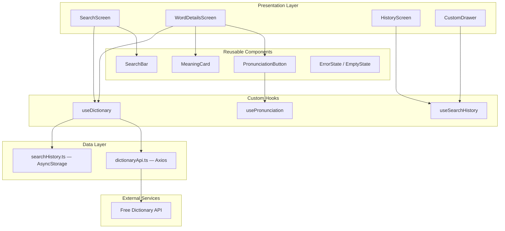
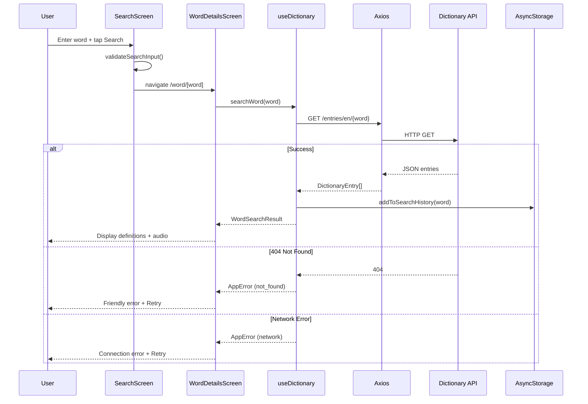

# LexiDict — Design & Architecture

**Client:** LexiTech Solutions Ltd  
**App:** Dictionary Mobile Application (LexiDict)  
**API:** [Free Dictionary API](https://dictionaryapi.dev/)

---

## 1. Application Architecture



---

## 2. Data Flow Diagram (Search Flow)



---

## 3. API Integration

| Method | Endpoint | Description |
|--------|----------|-------------|
| `GET` | `https://api.dictionaryapi.dev/api/v2/entries/en/{word}` | Fetch definitions, phonetics, audio, examples |

**Example:** `GET https://api.dictionaryapi.dev/api/v2/entries/en/hello`

**Response fields used:**
- `word` — display title
- `phonetic` / `phonetics[].text` — phonetic spelling
- `phonetics[].audio` — pronunciation MP3 URL
- `meanings[].partOfSpeech` — noun, verb, etc.
- `meanings[].definitions[].definition` — definition text
- `meanings[].definitions[].example` — usage example

**HTTP client:** Axios (`src/services/dictionaryApi.ts`)

---

## 4. Screens & Navigation

| Screen | Route | Description |
|--------|-------|-------------|
| Home / Search | `(drawer)/index` | Search input, validation, recent searches, popular words |
| Search History | `(drawer)/history` | Full history list with timestamps |
| Word Details | `/word/[word]` | Definitions, phonetics, pronunciation, examples |

**Navigation:** Expo Router + Drawer (`@react-navigation/drawer`)

---

## 5. Activity Checklist (Assignment Requirements)

### Activity 1 — Word Search & API Integration
- [x] Search screen with text input and search button
- [x] Input validation (empty, min length, character rules)
- [x] Dynamic API URL construction
- [x] Axios HTTP GET request
- [x] Loading indicator during fetch
- [x] JSON response parsing
- [x] Temporary storage in hook state for navigation

### Activity 2 — Display Word Details
- [x] Extract word, phonetics, meanings, definitions
- [x] Prominent word title with gradient header
- [x] Phonetic spelling display
- [x] Part-of-speech badges
- [x] Definitions listed per part of speech
- [x] Example sentences in styled cards
- [x] ScrollView for long content
- [x] Consistent spacing and card design

### Activity 3 — Audio Pronunciation
- [x] Detect audio URL from API response
- [x] Speaker icon (PronunciationButton)
- [x] Load and play audio via expo-audio (lazy-loaded)
- [x] Play / pause / stop controls
- [x] Multiple pronunciation URL support
- [x] Hide button when no audio and no fallback
- [x] TTS fallback via expo-speech when MP3 unavailable
- [x] Graceful playback error handling

### Activity 4 — Drawer Navigation & Search History
- [x] Drawer navigator with custom content
- [x] AsyncStorage search history
- [x] Auto-add on successful search
- [x] Deduplication (most recent first)
- [x] History in drawer and dedicated screen
- [x] Tap history item → re-fetch word
- [x] Clear all history

### Activity 5 — Error Handling & User Feedback
- [x] 404 word-not-found detection
- [x] Network connectivity check (expo-network)
- [x] Friendly error messages
- [x] Retry button on recoverable errors
- [x] Loading hidden on error
- [x] Malformed response handling
- [x] Empty state UI

---

## 6. Tech Stack

| Layer | Technology |
|-------|-----------|
| Framework | React Native + Expo SDK 56 |
| Language | TypeScript |
| Routing | Expo Router + Drawer |
| HTTP | Axios |
| Storage | AsyncStorage |
| Audio | expo-audio + expo-speech (fallback) |
| Styling | NativeWind (Tailwind CSS) |
| Fonts | Montserrat + Inter |

---

## 7. Folder Structure

```
src/
├── app/              # Expo Router layouts & routes
├── components/       # Reusable UI components
├── screens/          # Screen containers
├── services/         # Axios API client
├── hooks/            # Custom React hooks
├── storage/          # AsyncStorage persistence
├── types/            # TypeScript interfaces
├── utils/            # Helpers, navigation, audio
├── constants/        # Theme tokens, API URLs
└── assets/           # Static assets
```
